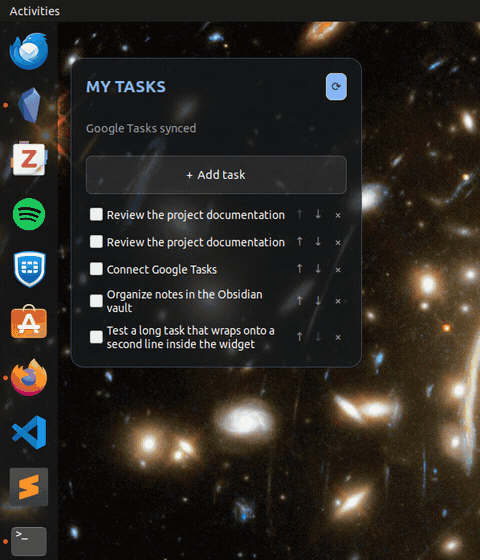

# Desktop Todo Widget Starter

A small, clickable GTK task list that sits on an Ubuntu desktop. Tasks live in
a Markdown note, which can be placed inside an Obsidian vault, and may optionally
sync with a dedicated Google Tasks list.

> This is a developer starter, not a polished consumer app. It is intentionally
> small and readable so you can fork it, understand it, and adapt its behavior
> to your desktop environment.

## Demo



## What it includes

- clickable add, complete, delete, clear, and reorder controls;
- configurable position and maximum width, with wrapping for long tasks;
- a dedicated Markdown note as the local source;
- optional two-way Google Tasks synchronization;
- session autostart, plus simple start/stop/restart commands;
- no root service, database, embedded password form, or bundled credentials.

The primary target is GNOME on X11. Wayland restricts window positioning and
stacking, so results vary by compositor.

## Install on Ubuntu

```bash
sudo apt update
sudo apt install python3 python3-gi gir1.2-gtk-3.0 python3-requests
git clone https://github.com/Lucas-Armand/desktop-todo-widget.git
cd desktop-todo-widget
chmod +x install.sh uninstall.sh
./install.sh
desktop-todo
```

The installer is per-user and does not use `sudo`. It also creates a GNOME
autostart entry. Log out and in once if `~/.local/bin` is not yet on your PATH.

Useful commands:

```bash
desktop-todo start
desktop-todo stop
desktop-todo restart
desktop-todo position 88 72
desktop-todo width 380
desktop-todo width auto
```

## Configuration

Settings live at `~/.config/desktop-todo/config.json`. The initial file is copied
from [config.example.json](config.example.json):

```json
{
  "markdown_file": "~/.local/share/desktop-todo/tasks.md",
  "google_sync": false,
  "google_task_list": "Desktop Todo",
  "x": 88,
  "y": 72,
  "max_width": 350
}
```

Restart the widget after editing configuration. Set `max_width` to `null` for
automatic width.

### Use an Obsidian note

Set `markdown_file` to a dedicated note inside your vault, for example:

```json
"markdown_file": "~/Documents/My Vault/Projects/Desktop Todo.md"
```

Important: the widget owns and rewrites the complete configured file. Do not
point it at a note containing unrelated text. Google IDs appear in HTML comments,
which Obsidian hides in Reading view:

```markdown
- [ ] Prepare the presentation <!-- google-task:REMOTE_ID -->
- [x] Review the document <!-- google-task:REMOTE_ID -->
```

## Optional Google Tasks sync

Google sync is disabled by default. Each user creates their own Desktop OAuth
client, stores it outside the repository, and enables `google_sync`. No Google
password is handled by the widget.

Follow [the complete Google Tasks setup](docs/google-tasks-setup.md), including
the Testing-mode test-user step that prevents `403 access_denied`.

Google Tasks is used because it provides an official read/write API. Google
Keep does not provide the suitable personal checklist workflow; the tradeoff is
explained in [Why not Google Keep?](docs/why-not-google-keep.md).

## Security and limitations

- OAuth credentials, tokens, configuration, and real tasks are ignored by Git.
- OAuth uses the system browser, PKCE, random state, and a temporary loopback
  callback; stored tokens use mode `0600`.
- Local changes are written before network calls, but this starter has no full
  offline queue or automatic conflict-resolution engine.
- Review [SECURITY.md](SECURITY.md) and [ARCHITECTURE.md](ARCHITECTURE.md) before
  using it for sensitive or important tasks.

To remove the installed code and autostart entry while preserving user data:

```bash
./uninstall.sh
```

## Development

```bash
PYTHONPATH=src python3 -m desktop_todo
python3 -m compileall -q src
python3 -m unittest discover -s tests
```

Contributions should keep the project small, English-only, configurable without
source edits, and free of personal paths or credentials.

## License

[MIT](LICENSE)
